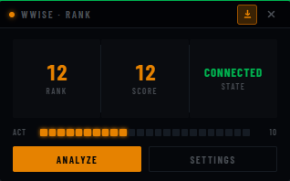
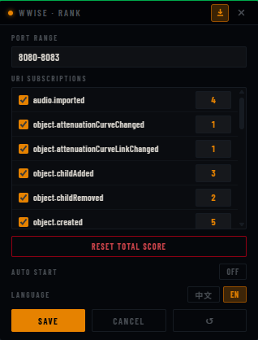

# Wwise Rank

> 为 Wwise 音频工程师设计的实时操作记录与积分悬浮窗

[](LICENSE)

Wwise Rank 是一款基于 Tauri 的轻量级桌面悬浮窗应用，通过 WAAPI（Wwise Authoring API）接收 Wwise 的操作事件，并以游戏化积分的方式记录工作投入，帮助你直观感知当前的工作节奏与效率。

---

## 截图预览





---

## 功能亮点

- **实时连接** — 自动扫描并连接本机运行的 Wwise 实例，断连后自动重试（指数退避）
- **积分系统** — 22 种 WAAPI 操作事件各有不同分值，按操作复杂度加权（1–5 分）
- **三栏读数** — RANK（总排名分）、SCORE（本次会话分）、STATE（连接状态）一览无余
- **VU 电平条** — 24 段可视化活跃度指示器，按频率分三色区（绿 / 橙 / 红）
- **悬浮置顶** — 320×200 无边框透明窗口，可拖拽、可吸附到屏幕边缘、支持固定/取消置顶
- **内置设置面板** — 可在应用内配置端口范围、每个 Topic 的启用状态与分值、开机自启、界面语言
- **双语界面** — 内置中文 / English 切换，偏好持久保存

---

## 隐私与安全

- **完全本地运行** — 应用仅通过本机回环地址（`127.0.0.1`）与 Wwise 通信，**不会建立任何外部网络连接**
- **无数据上传** — 所有积分数据、设置文件均仅存储在本机应用数据目录，不会上传至任何服务器或第三方平台
- **无遥测** — 应用不包含任何崩溃上报、使用统计或分析模块

---

## 快速开始

### 下载安装（推荐）

前往 [Releases](../../releases/latest) 页面，下载最新版 `.msi` 安装包，双击安装后启动 `wwise-rank.exe` 即可。

启动前请确保 Wwise 已开启并启用了 WAAPI（详见[用户手册 §2.3](docs/用户手册.md#23-启动前准备)）。

### 从源码构建

**环境要求：**

| 工具 | 版本要求 |
|------|----------|
| Rust | 1.70+ |
| Node.js | 18+ |
| pnpm | 8+ |
| Wwise | 已启用 WAAPI（本地 WebSocket） |

**开发运行：**

```bash
pnpm install
pnpm tauri dev
```

**构建发布包：**

```bash
pnpm tauri build
```

构建产物位于 `src-tauri/target/release/bundle/`。

---

## 使用说明

详见 [用户手册](docs/用户手册.md)，涵盖：

- 界面说明与操作方式
- 积分规则与计分表（[操作计分表](docs/操作计分表.md)）
- 内置设置面板（端口、Topic 订阅、分值、自启动、语言）
- 数据持久化说明
- 高级环境变量配置

---

## 技术栈

| 层 | 技术 |
|----|------|
| 前端 | Vue 3 + TypeScript + Vite |
| 后端 | Rust + Tauri 2 |
| 异步运行时 | Tokio |
| WAAPI 客户端 | waapi-rs |
| 序列化 | serde / serde_json |

---

## 数据文件

应用运行时会在系统应用数据目录下生成以下文件：

| 文件 | 说明 |
|------|------|
| `score.json` | 总分与各事件触发计数（持久化） |
| `settings.json` | 用户设置：端口范围、Topic 启用状态与分值（首次启动自动生成） |

**Windows 路径：** `%APPDATA%\com.xmimu.wwise-rank\`

---

## 开发 IDE 推荐

VS Code + 以下插件：

- [Vue - Official](https://marketplace.visualstudio.com/items?itemName=Vue.volar)
- [Tauri](https://marketplace.visualstudio.com/items?itemName=tauri-apps.tauri-vscode)
- [rust-analyzer](https://marketplace.visualstudio.com/items?itemName=rust-lang.rust-analyzer)

---

## License

[MIT](LICENSE) © 2026 xmimu
